# Dr. M.G.R. Educational and Research Institute
### (Deemed to be University)

---

# AI-POWERED SMART HELMET WITH ACCIDENT PREDICTION AND EMERGENCY ALERT SYSTEM

**A MINI PROJECT REPORT**

Submitted in partial fulfillment of the requirements for the award of the degree of

**Bachelor of Technology**
in
**Computer Science and Engineering (Artificial Intelligence and Data Science)**

**Department of Computer Science and Engineering (AI & DS)**

Submitted by:
**KARTHICK S**
**MIDHUN SATHISHKUMAR**
**KAMESH KUMAR J**

**Academic Year: 2025 - 2026**

---

## CERTIFICATE

*(This page is a placeholder for the official certificate. Please replace with the signed certificate from the college.)*

This is to certify that the Mini Project entitled **"AI-Powered Smart Helmet with Accident Prediction and Emergency Alert System"** is a bonafide work carried out by **Karthick S**, **Midhun Sathishkumar**, and **Kamesh Kumar J** in partial fulfillment of the requirements for the award of the degree of **Bachelor of Technology in Computer Science and Engineering (Artificial Intelligence and Data Science)** from **Dr. M.G.R. Educational and Research Institute** during the academic year **2025 - 2026**.

**Internal Guide**
Name: ___________________________
Signature: ________________________
Date: ____________________________

**Head of Department**
Name: ___________________________
Signature: ________________________
Date: ____________________________

---

## ACKNOWLEDGEMENT

We would like to express our sincere gratitude to our project guide and the faculty of the Department of Computer Science and Engineering (AI & DS) at Dr. M.G.R. Educational and Research Institute for their continuous support, encouragement, and valuable guidance throughout the course of this mini project.

We extend our heartfelt thanks to the Head of the Department for providing us with the necessary resources and infrastructure to carry out this project successfully.

We are also grateful to our friends and family for their moral support and motivation during the development of this project.

Finally, we thank all the open-source communities and documentation authors whose tools, libraries, and resources made this project possible.

**Karthick S**
**Midhun Sathishkumar**
**Kamesh Kumar J**

---

## ABSTRACT

Road accidents involving two-wheeler vehicles constitute a significant proportion of global traffic fatalities. Key contributing factors include overspeeding, riding under the influence of alcohol, rider drowsiness, and delayed emergency medical response during the critical "Golden Hour." Traditional helmets provide only passive physical protection and lack intelligent features for proactive safety monitoring.

This project presents an **AI-Powered Smart Helmet with Accident Prediction and Emergency Alert System**, a full-stack software prototype that demonstrates the integration of Artificial Intelligence, Internet of Things (IoT), and Machine Learning technologies for motorcycle rider safety. The system employs a **Random Forest Classifier** trained on synthetic sensor data to predict rider conditions across three classes: **Safe**, **At-Risk**, and **Danger**.

The current prototype is a **50% Working Software Prototype** that uses **simulated sensor data** to demonstrate the complete system pipeline. The backend is built using **Python FastAPI**, which processes sensor telemetry, executes real-time ML predictions, and manages emergency alert dispatching. The frontend is a modern **React.js** web dashboard built with **Vite**, providing live telemetry visualization, AI prediction panels, historical data charts, and an emergency SOS alert card with GPS location and Google Maps integration.

The system supports five simulation modes - **Safe, Risky, Drunk, Drowsy, and Crash** - each demonstrating distinct rider conditions with corresponding sensor value patterns and AI predictions. In crash mode, the system automatically triggers an emergency SOS alert with GPS coordinates and simulated GSM SMS dispatch to emergency contacts.

Real hardware integration using **ESP32 microcontrollers**, **MPU6050 accelerometers**, **MQ-3 alcohol sensors**, **NEO-6M GPS modules**, and **SIM800L GSM modules** is planned as future scope to evolve this software prototype into a complete physical product.

**Keywords**: Smart Helmet, Accident Prediction, Emergency Alert, Random Forest, IoT, Machine Learning, Road Safety, GPS Tracking, GSM Alert

---

## TABLE OF CONTENTS

| Chapter | Title | Page |
|---------|-------|------|
| | Certificate | ii |
| | Acknowledgement | iii |
| | Abstract | iv |
| | Table of Contents | v |
| | List of Figures | vi |
| | List of Tables | vii |
| 1 | Introduction | 1 |
| 2 | Problem Definition | 4 |
| 3 | Objective of the Project | 6 |
| 4 | Literature Survey | 7 |
| 5 | Requirement Analysis | 9 |
| 6 | System Design | 12 |
| 7 | Implementation | 18 |
| 8 | Modules Description | 21 |
| 9 | Output and Screenshots | 23 |
| 10 | Testing | 29 |
| 11 | Advantages and Applications | 31 |
| 12 | Limitations | 32 |
| 13 | Future Scope | 33 |
| 14 | Conclusion | 34 |
| 15 | References / Bibliography | 35 |
| | Appendix A: Backend API Details | 36 |
| | Appendix B: Important Code Snippets | 37 |
| | Appendix C: Run Commands | 39 |
| | Appendix D: Demo Flow | 40 |
| | Appendix E: Hardware Components List | 41 |

---

## LIST OF FIGURES

| Figure No. | Title | Page |
|------------|-------|------|
| Fig. 1 | System Architecture Diagram | 12 |
| Fig. 2 | Data Flow Diagram (Level-1) | 13 |
| Fig. 3 | Use Case Diagram | 14 |
| Fig. 4 | Activity Diagram | 15 |
| Fig. 5 | Sequence Diagram | 16 |
| Fig. 6 | Class Diagram | 17 |
| Fig. 7 | Home Page of Smart Helmet Website | 23 |
| Fig. 8 | Project Team Section | 24 |
| Fig. 9 | Live Dashboard in Safe Mode | 24 |
| Fig. 10 | Risky Mode Showing At-Risk Prediction | 25 |
| Fig. 11 | Drunk Mode Showing Alcohol Detection | 25 |
| Fig. 12 | Drowsy Mode Showing Fatigue Warning | 26 |
| Fig. 13 | Crash Mode Showing Emergency SOS Alert | 26 |
| Fig. 14 | GPS Location and Google Maps Link | 27 |
| Fig. 15 | Project Modules Page | 27 |
| Fig. 16 | Future Hardware Integration Diagram | 28 |
| Fig. 17 | FastAPI Documentation Page | 28 |

---

## LIST OF TABLES

| Table No. | Title | Page |
|-----------|-------|------|
| Table 1 | Comparison of Existing and Proposed Systems | 9 |
| Table 2 | Functional Requirements | 10 |
| Table 3 | Non-Functional Requirements | 10 |
| Table 4 | Software Requirements | 11 |
| Table 5 | Hardware Requirements (Future Scope) | 11 |
| Table 6 | ML Prediction Labels and Probabilities | 19 |
| Table 7 | Simulation Mode Parameters | 20 |
| Table 8 | Test Cases and Results | 29 |

---

# CHAPTER 1: INTRODUCTION

## 1.1 Overview

The rapid expansion of two-wheeler usage in urban and rural areas has led to a corresponding increase in road accidents, particularly involving motorcycles. According to the World Health Organization (WHO), road traffic injuries are the leading cause of death among young people aged 15 to 29 years, and two-wheeler riders constitute a disproportionately large share of these casualties. Traditional helmets, while effective in providing physical protection to the skull, offer no intelligent capabilities for accident prediction, rider condition monitoring, or emergency communication.

This project, titled **"AI-Powered Smart Helmet with Accident Prediction and Emergency Alert System,"** presents a technology-driven solution that transforms an ordinary helmet into an intelligent safety device. By integrating multiple sensors, a Machine Learning prediction engine, and an automated emergency alert mechanism, the system aims to significantly reduce accident-related fatalities by enabling proactive safety monitoring and rapid emergency response.

The current implementation is a **50% working software prototype** that demonstrates the complete data pipeline - from sensor data acquisition (simulated) to AI-based risk prediction and emergency alert dispatch - via a live web-based dashboard. Real hardware integration is planned as future scope.

## 1.2 Road Safety and Two-Wheeler Accident Problem

Two-wheeler vehicles account for a significant percentage of overall traffic on Indian roads. The National Crime Records Bureau (NCRB) data indicates that India witnesses a disproportionately high number of road accident fatalities involving motorcycle riders compared to other vehicle categories. The primary causes include:

- **Overspeeding**: Exceeding safe speed limits, especially on highways and poorly maintained roads, leads to loss of vehicle control.
- **Alcohol Impairment**: Riding under the influence of alcohol severely compromises judgment, reaction time, and motor coordination.
- **Rider Fatigue and Drowsiness**: Long-distance riders often experience microsleep episodes that lead to sudden loss of vehicular control.
- **Delayed Emergency Response**: In many accident scenarios, especially in remote areas or during nighttime, there is a significant delay between the accident occurrence and the arrival of medical help. This delay, often exceeding the critical "Golden Hour," substantially reduces survival rates.

## 1.3 Need for Smart Helmet System

The limitations of traditional helmets highlight the urgent need for a smart helmet system that can:

1. **Continuously monitor** rider parameters such as speed, body orientation, blood alcohol levels, and fatigue levels.
2. **Predict potential dangers** before they escalate into accidents by analyzing sensor patterns using Artificial Intelligence.
3. **Automatically alert** emergency services and family members with precise GPS location data in the event of a crash, without requiring manual intervention from the rider or bystanders.
4. **Prevent intoxicated riding** by locking the vehicle ignition system when unsafe alcohol levels are detected.

A smart helmet addresses all of these needs by embedding sensors, microcontrollers, and communication modules within the helmet structure, transforming it from a passive protective device into an active safety system.

## 1.4 Role of AI and IoT in Rider Safety

**Artificial Intelligence (AI)** enables the system to analyze multi-dimensional sensor data and classify rider conditions in real-time. Rather than relying on simple threshold-based rules, AI models such as Random Forest classifiers can learn complex non-linear relationships between sensor readings and safety outcomes, providing more accurate and reliable predictions.

**Internet of Things (IoT)** provides the framework for connecting physical sensors (accelerometers, alcohol sensors, GPS modules) to cloud-based processing systems via wireless communication protocols. IoT architecture enables real-time data streaming, remote monitoring, and automated response mechanisms.

The combination of AI and IoT in this project creates an intelligent safety ecosystem where:
- Sensors continuously collect rider and environmental data.
- AI algorithms process this data to predict risk levels.
- IoT communication channels transmit alerts to emergency services.
- A web dashboard provides real-time visibility into rider safety status.

## 1.5 Purpose of the Project

The primary purpose of this project is to demonstrate the feasibility and effectiveness of an AI-powered smart helmet system through a working software prototype. The project aims to:

1. Showcase the integration of simulated IoT sensor data with a Machine Learning prediction model.
2. Provide a real-time web dashboard for monitoring rider safety status.
3. Simulate emergency alert mechanisms including GPS location tracking and SMS dispatch.
4. Serve as a foundation for future hardware implementation using actual sensors and microcontrollers.
5. Demonstrate practical applications of AI, IoT, and web technologies in the domain of road safety.

## 1.6 Scope of the Project

The scope of this project encompasses the following:

- **Software Development**: A full-stack web application comprising a FastAPI backend (Python) and a React.js frontend (Vite).
- **Machine Learning Model**: A Random Forest Classifier trained on synthetic helmet sensor data to classify rider conditions.
- **Sensor Simulation**: Software-based simulation of sensor readings for speed, alcohol level, drowsiness score, vibration, accelerometer (3-axis), and gyroscope (3-axis).
- **Dashboard Interface**: A professional web dashboard displaying live telemetry, AI predictions, historical charts, and emergency alerts.
- **Emergency Alert Simulation**: Simulated crash detection with GPS coordinate extraction and SOS message dispatch.
- **Demo Modes**: Five distinct simulation modes (Safe, Risky, Drunk, Drowsy, Crash) for demonstration purposes.

**Out of Scope (Current Version)**:
- Physical hardware prototype with real sensors.
- Actual GSM SMS transmission.
- Mobile application development.
- Cloud database integration.
- Real-world accident dataset training.

---

# CHAPTER 2: PROBLEM DEFINITION

## 2.1 Existing Problem

Motorcycle accidents remain one of the most pressing road safety challenges worldwide. Despite advancements in vehicle technology and road network infrastructure, two-wheeler riders continue to face elevated risks due to their exposed riding position and the inherent instability of two-wheeled vehicles.

The existing approach to motorcycle safety relies primarily on:
- **Passive helmets**: Helmets that only provide impact protection without any monitoring or alerting capabilities.
- **Manual accident reporting**: Dependence on bystanders or the rider themselves to call emergency services after an accident.
- **Post-accident response**: Emergency medical services are activated only after an accident is reported, leading to significant response delays.

This reactive approach fails to address the fundamental issue of accident prevention and timely emergency response.

## 2.2 Limitations of Traditional Helmets

Traditional motorcycle helmets, while essential for impact protection, suffer from several significant limitations:

1. **No sensing capability**: Traditional helmets cannot detect any parameters about the rider's condition or the riding environment.
2. **No communication capability**: There is no built-in mechanism to communicate with external systems, emergency services, or family members.
3. **No predictive intelligence**: Without sensors and processing capabilities, traditional helmets cannot anticipate or warn about potential dangers.
4. **No accident detection**: A traditional helmet cannot automatically detect that an accident has occurred and initiate emergency response procedures.
5. **No impairment detection**: There is no capability to detect if the rider is under the influence of alcohol or is dangerously fatigued.

These limitations mean that traditional helmets provide only a last line of defense - physical impact protection - rather than serving as a proactive safety system.

## 2.3 Delayed Emergency Response Issue

One of the most critical factors in accident survival is the speed of emergency medical response. Medical research has established the concept of the **"Golden Hour"** - the critical time window (approximately 60 minutes) after a traumatic injury during which prompt medical treatment significantly improves survival rates.

In many motorcycle accident scenarios, especially those occurring in:
- Remote or rural areas with limited bystander presence.
- Nighttime conditions when visibility is poor.
- Single-vehicle accidents where no other party is involved.
- Situations where the rider is unconscious and unable to call for help.

The delay between accident occurrence and emergency response arrival often exceeds the Golden Hour, dramatically reducing the chances of survival. An automated emergency alert system that immediately notifies rescue services with precise GPS coordinates can significantly reduce this critical delay.

## 2.4 Alcohol, Drowsiness, and Risky Riding Problems

### 2.4.1 Alcohol Impairment

Riding under the influence of alcohol is a major contributing factor in motorcycle accidents. Alcohol affects the rider by:
- Reducing reaction time and reflexes.
- Impairing judgment and decision-making.
- Compromising motor coordination and balance.
- Inducing overconfidence in riding ability.

Current approaches to addressing this issue (such as police checkpoints and breathalyzer tests) are effective only at specific locations and times, leaving vast stretches of roads unmonitored.

### 2.4.2 Drowsiness and Fatigue

Rider drowsiness, particularly during long-distance travel, is another significant safety concern. Fatigue leads to:
- Microsleep episodes where the rider briefly loses consciousness.
- Reduced situational awareness and delayed reactions.
- Gradual loss of postural control leading to swerving.

Unlike alcohol impairment, which can be detected through breathalyzer tests, drowsiness is difficult to detect externally and often goes unnoticed until an accident occurs.

### 2.4.3 Risky Riding Behavior

Overspeeding, aggressive acceleration, and sharp turns contribute to a large number of motorcycle accidents. Real-time monitoring of behavioral patterns helps identify at-risk riders before accidents occur.

## 2.5 Problem Statement

Motorcycle riders face significant risks due to road accidents, unsafe riding behavior, delayed medical response, and lack of proactive safety systems. Traditional helmets provide physical protection but lack intelligent features that can predict accidents, monitor rider condition, or provide emergency communication.

There is a clear need for an intelligent helmet system that can:
- Continuously monitor rider parameters using multiple sensors.
- Employ Artificial Intelligence to predict accident risk levels in real-time.
- Automatically detect crash events and dispatch emergency alerts with GPS coordinates.
- Detect and respond to alcohol impairment and rider drowsiness.
- Provide a real-time monitoring dashboard for safety oversight.

---

# CHAPTER 3: OBJECTIVE OF THE PROJECT

The primary objectives of this project are as follows:

1. **To monitor rider safety using smart helmet sensor data**: Design and implement a system that processes multiple sensor inputs - including speed, vibration, alcohol level, drowsiness score, 3-axis accelerometer, and 3-axis gyroscope data - to comprehensively assess the rider's current condition and riding environment.

2. **To classify rider condition as Safe, At-Risk, or Danger**: Develop a Machine Learning model (Random Forest Classifier) capable of analyzing the 10-dimensional sensor feature vector and classifying the rider's condition into one of three risk levels with associated confidence probabilities.

3. **To detect risky riding, alcohol impairment, drowsiness, and crash conditions**: Implement distinct detection mechanisms for each hazard type:
   - Overspeeding and unstable riding (Risky)
   - Elevated blood alcohol concentration (Drunk)
   - High fatigue/drowsiness index (Drowsy)
   - High-G impact and vibration spike (Crash)

4. **To provide a real-time web dashboard**: Build a professional, responsive web dashboard using React.js that displays live sensor telemetry, AI risk predictions with probability charts, historical data trends, and emergency alert information.

5. **To simulate GPS-based emergency alert**: Demonstrate an emergency SOS system that extracts GPS coordinates upon crash detection and generates a Google Maps link for emergency responders, simulating GSM SMS dispatch to pre-configured emergency contacts.

6. **To demonstrate AI and IoT integration through a software prototype**: Create a working 50% software prototype that demonstrates the complete pipeline from sensor data collection to AI prediction to emergency response, validating the system concept before committing to hardware development.

7. **To provide future scope for hardware implementation**: Design the software architecture in a modular manner that allows straightforward integration with physical hardware components (ESP32, MPU6050, MQ-3, NEO-6M, SIM800L) in future iterations.

---

# CHAPTER 4: LITERATURE SURVEY

## 4.1 Smart Helmet Systems

The concept of smart helmets has evolved significantly in recent years with the advancement of embedded systems and IoT technologies. Early smart helmet designs focused primarily on adding basic features such as turn indicators and rear-view cameras. However, modern approaches integrate multiple sensors, wireless communication modules, and intelligent processing capabilities.

Research in this domain has explored the use of accelerometers and gyroscopes for detecting helmet orientation, impact forces, and riding patterns. Several studies have demonstrated the feasibility of using MEMS (Micro-Electro-Mechanical Systems) sensors within helmet cavities for real-time data acquisition without significantly increasing the helmet's weight or compromising rider comfort.

The integration of microcontrollers such as Arduino and ESP32 has enabled on-device processing of sensor data, allowing smart helmets to operate as edge computing devices with reduced latency for safety-critical decisions.

## 4.2 IoT-Based Accident Detection Systems

Internet of Things (IoT) technology has been extensively applied in accident detection and emergency response systems. IoT-based approaches typically involve:
- Sensor nodes attached to vehicles or rider equipment for data collection.
- Wireless communication protocols (Wi-Fi, Bluetooth, GSM, LoRa) for transmitting data to cloud servers or emergency services.
- Cloud-based processing platforms for data analysis and alert generation.

Key challenges addressed in the literature include power management for battery-operated IoT devices, reliable wireless communication in diverse environments, and minimizing false positive accident detections. Solutions proposed include multi-sensor fusion techniques, adaptive threshold algorithms, and confirmation protocols before dispatching emergency alerts.

## 4.3 Alcohol Detection in Vehicle Safety

Breath alcohol detection using semiconductor-based gas sensors (such as the MQ-3 sensor) has been widely researched for vehicle safety applications. The MQ-3 sensor detects ethanol vapors in the rider's breath and provides an analog voltage output proportional to the alcohol concentration.

Studies have demonstrated the integration of alcohol sensors with vehicle ignition systems to create "alcohol interlock" mechanisms that prevent vehicle operation when unsafe alcohol levels are detected. Important design considerations include sensor calibration, response time, sensitivity to environmental factors (temperature, humidity), and avoiding false positives from food or medications.

The concept of integrating alcohol detection within a helmet is particularly relevant for two-wheelers, as the sensor can be positioned near the chin guard to capture breath samples during normal breathing.

## 4.4 Drowsiness Detection Systems

Drowsiness detection has been approached through several methodologies in the literature:

1. **Vision-based methods**: Using cameras to monitor eye blink frequency, eyelid closure duration (PERCLOS), head nodding patterns, and yawning detection. These methods require image processing and often use deep learning models for feature extraction.

2. **Physiological signal-based methods**: Monitoring EEG (electroencephalography), EOG (electrooculography), and EMG (electromyography) signals to detect fatigue-related changes in brain and muscle activity.

3. **Behavioral pattern-based methods**: Analyzing driving patterns such as steering wheel deviation, lane departure, and speed variation to infer driver drowsiness.

For helmet-based systems, a combination of infrared (IR) sensors to detect eye blink patterns and behavioral analysis through accelerometer/gyroscope data provides a practical approach that does not require bulky camera equipment.

## 4.5 GPS and GSM Emergency Alert Systems

The combination of GPS (Global Positioning System) receivers and GSM (Global System for Mobile Communications) modules has been extensively used in vehicle tracking and emergency alert systems. In accident detection applications:

- **GPS modules** (such as NEO-6M) provide real-time latitude and longitude coordinates by parsing NMEA (National Marine Electronics Association) data strings from satellite signals.
- **GSM modules** (such as SIM800L) enable cellular SMS communication, allowing the system to send text messages containing accident details and GPS coordinates to predefined emergency contacts.

Research has shown that including a direct Google Maps URL with GPS coordinates in the SMS message significantly improves emergency response efficiency, as responders can immediately navigate to the accident location using their mobile devices.

## 4.6 Machine Learning for Risk Prediction

Machine Learning algorithms have been applied to various road safety applications, including accident prediction, driver behavior analysis, and risk assessment. Common approaches include:

- **Decision Trees and Random Forests**: Ensemble methods that combine multiple decision trees to achieve robust classification performance. Random Forests are particularly effective for multi-class classification tasks with tabular sensor data.
- **Support Vector Machines (SVM)**: Effective for binary and multi-class classification with clear margin separation between classes.
- **Neural Networks and Deep Learning**: Advanced approaches that can learn complex patterns from large datasets, though they require more computational resources and training data.

For this project, the **Random Forest Classifier** was selected due to its:
- High accuracy on tabular sensor data.
- Robustness against overfitting.
- Ability to handle the 10-dimensional feature space effectively.
- Fast inference time suitable for real-time prediction.
- Interpretability through feature importance analysis.

## 4.7 Summary of Literature Survey

The literature survey reveals that smart helmet technology is an active and growing area of research that combines IoT, AI, and communication technologies for rider safety. Key findings include:

1. Multi-sensor fusion using accelerometers, gas sensors, and GPS modules is a proven approach for comprehensive rider monitoring.
2. Machine Learning classifiers, particularly Random Forests, are effective for real-time risk classification from sensor data.
3. GPS-GSM integration provides reliable emergency communication for accident scenarios.
4. Alcohol detection using MQ-3 sensors and drowsiness detection using IR sensors are feasible within the helmet form factor.
5. Software prototyping before hardware development is a practical approach for validating system concepts.

*Note: Specific research paper references have been omitted to avoid unverified citations. Placeholder references are provided in Chapter 15 for the reader to replace with verified sources.*

---

# CHAPTER 5: REQUIREMENT ANALYSIS

## 5.1 Existing System

The existing system for motorcycle rider safety consists of conventional helmets that provide only passive physical protection. The current limitations include:

- Helmets have no embedded sensors or monitoring capabilities.
- Accident detection relies entirely on manual reporting by bystanders or the rider.
- There is no mechanism for real-time rider condition monitoring.
- Emergency response is delayed due to the lack of automated alert systems.
- There is no capability to detect alcohol impairment or drowsiness before an accident occurs.

**Table 1: Comparison of Existing and Proposed Systems**

| Feature | Existing System | Proposed System |
|---------|----------------|-----------------|
| Helmet Type | Passive (physical protection only) | Active (sensor-integrated smart helmet) |
| Accident Detection | Manual (bystander reporting) | Automatic (sensor-based crash detection) |
| Risk Prediction | Not available | AI-based (Random Forest Classifier) |
| Alcohol Detection | Not available | MQ-3 sensor-based breath analysis |
| Drowsiness Detection | Not available | IR sensor / fatigue score monitoring |
| Emergency Alert | Manual phone call | Automated GPS + GSM SMS dispatch |
| Real-time Monitoring | Not available | Web-based live dashboard |
| Response Time | 15-60+ minutes (Golden Hour delay) | Immediate automated alert |

## 5.2 Proposed System

The proposed system is an AI-Powered Smart Helmet that integrates multiple sensors, a Machine Learning prediction engine, and an automated emergency alert mechanism. The current implementation is a 50% working software prototype that simulates the complete system pipeline:

1. **Simulated sensor data** representing helmet-mounted sensors feeds into the backend system.
2. **A FastAPI backend** processes sensor readings and passes them to a trained Random Forest ML model.
3. **The ML model** classifies the rider's condition as Safe, At-Risk, or Danger with confidence probabilities.
4. **A React web dashboard** displays live sensor telemetry, AI predictions, historical trends, and emergency alerts.
5. **Emergency alert simulation** triggers when a crash is detected, generating GPS coordinates and simulating SMS dispatch.

The software prototype uses simulated sensor data for demonstration purposes. Real hardware integration is planned as future scope.

## 5.3 Functional Requirements

**Table 2: Functional Requirements**

| ID | Requirement | Description |
|----|------------|-------------|
| FR-01 | Display live sensor values | The dashboard shall display real-time values for speed, alcohol level, drowsiness score, vibration, accelerometer (3-axis), and gyroscope (3-axis). |
| FR-02 | Switch simulation modes | The user shall be able to switch between Safe, Risky, Drunk, Drowsy, and Crash simulation modes. |
| FR-03 | Predict rider state | The system shall use a trained ML model to predict the rider's condition as Safe, At-Risk, or Danger. |
| FR-04 | Detect alcohol condition | The system shall detect elevated alcohol levels and display appropriate warnings. |
| FR-05 | Detect drowsiness condition | The system shall detect high drowsiness scores and display fatigue warnings. |
| FR-06 | Detect crash condition | The system shall detect high-G impact and vibration spikes indicating a crash event. |
| FR-07 | Display GPS location | The system shall display the rider's GPS coordinates and provide a Google Maps link. |
| FR-08 | Show emergency SOS alert | Upon crash detection, the system shall display an emergency SOS card with crash details, GPS coordinates, and GSM dispatch status. |

## 5.4 Non-Functional Requirements

**Table 3: Non-Functional Requirements**

| ID | Requirement | Description |
|----|------------|-------------|
| NFR-01 | User-friendly interface | The dashboard shall have an intuitive, visually appealing interface. |
| NFR-02 | Fast response time | The system shall update sensor data and predictions within 1 second. |
| NFR-03 | Demo mode accuracy | Predictions shall be consistent with the selected simulation mode. |
| NFR-04 | Scalability | The architecture shall support future hardware integration. |
| NFR-05 | Maintainability | Code shall be modular and well-documented. |
| NFR-06 | Presentation readiness | The prototype shall be suitable for live demonstration. |

## 5.5 Software Requirements

**Table 4: Software Requirements**

| Component | Technology | Version/Details |
|-----------|-----------|----------------|
| Programming Language | Python | 3.9+ |
| Backend Framework | FastAPI | Latest stable |
| ASGI Server | Uvicorn | Latest stable |
| Frontend Framework | React.js | 18.x |
| Build Tool | Vite | 5.x |
| Frontend Language | JavaScript (ES6+) | - |
| Markup & Styling | HTML5, CSS3 | - |
| ML Library | Scikit-learn | Latest stable |
| Numerical Computing | NumPy, Pandas | Latest stable |
| Model Serialization | Joblib | Latest stable |
| Chart Library | Recharts | Latest stable |
| Icon Library | Lucide-React | Latest stable |
| Web Browser | Chrome / Firefox / Edge | Latest stable |
| IDE | VS Code / Antigravity IDE | - |
| OS | Windows / Linux / macOS | - |

## 5.6 Hardware Requirements (Future Scope)

**Table 5: Hardware Requirements (Future Scope)**

| Component | Specification | Purpose |
|-----------|--------------|---------|
| ESP32 Microcontroller | Dual-core, Wi-Fi + Bluetooth | Central processing unit for sensor data |
| MPU6050 | 6-axis accelerometer + gyroscope | Detect impacts, tilt, and vibration |
| MQ-3 Alcohol Sensor | Semiconductor gas sensor | Detect blood alcohol from breath |
| SW-420 Vibration Sensor | High-sensitivity vibration sensor | Detect mechanical impact and road vibration |
| NEO-6M GPS Module | Satellite-based positioning | Track real-time GPS coordinates |
| SIM800L GSM Module | Quad-band GSM transceiver | Send emergency SMS alerts |
| Active Buzzer | Piezoelectric buzzer | Audible warning alerts |
| Relay Module | 5V relay | Vehicle ignition lock control |
| Helmet | Standard ISI-certified helmet | Physical housing for all components |
| Battery | 3.7V Li-Po / Li-ion | Power supply for electronics |

*Note: These hardware components are listed for future implementation. The current software prototype uses simulated sensor data.*

---

# CHAPTER 6: SYSTEM DESIGN

## 6.1 System Architecture

The system architecture follows a layered design pattern that separates concerns across hardware, communication, processing, and presentation layers:

**Layer 1 - Sensor Hardware Layer (Future Scope)**:
The smart helmet houses multiple sensors within its cavity. The MPU6050 provides 3-axis acceleration and 3-axis angular velocity data. The MQ-3 sensor detects ethanol vapors from the rider's breath. The SW-420 sensor captures mechanical vibrations and impacts. The NEO-6M GPS module tracks satellite coordinates. An IR-based eye blink sensor monitors drowsiness.

**Layer 2 - Microcontroller Layer (Future Scope)**:
An ESP32 microcontroller serves as the central processing unit, collecting data from all sensors, performing initial preprocessing, and transmitting readings to the backend server via Wi-Fi or serial communication.

**Layer 3 - Backend Processing Layer (Implemented)**:
A FastAPI server receives sensor data (currently simulated), processes it through the Random Forest ML model, and serves REST API endpoints for the frontend dashboard. The backend manages simulation state, prediction history, and emergency alert logic.

**Layer 4 - AI/ML Prediction Layer (Implemented)**:
A trained Random Forest Classifier processes the 10-dimensional sensor feature vector and outputs risk classification (Safe, At-Risk, Danger) with associated probability distributions.

**Layer 5 - Frontend Presentation Layer (Implemented)**:
A React.js web dashboard built with Vite provides the user interface for real-time monitoring, displaying sensor telemetry cards, AI prediction panels, historical trend charts, and emergency SOS alerts.

**Layer 6 - Emergency Alert Layer (Simulated)**:
Upon crash detection, the system extracts GPS coordinates, generates a Google Maps URL, and simulates SIM800L GSM module-based SMS dispatch to emergency contacts.

*Fig. 1: System Architecture Diagram*

*(See report_assets/system_architecture.png)*

The architecture diagram illustrates the complete data flow from helmet sensors through the ESP32 microcontroller to the FastAPI backend, where AI/ML processing occurs, and finally to the React dashboard and emergency alert system.

## 6.2 Data Flow Diagram

The Level-1 Data Flow Diagram (DFD) illustrates how data moves through the system:

**External Entities**:
- Rider: Generates sensor data through riding behavior.
- Emergency Contacts: Receive SOS alerts in crash scenarios.
- Google Maps: Provides location visualization service.

**Processes**:
- Process 1.0 - Collect Sensor Data: Captures speed, alcohol, drowsiness, vibration, accelerometer, gyroscope, and GPS data from sensors (simulated in current version).
- Process 2.0 - Process and Predict Risk: Passes sensor data through the Random Forest classifier to determine rider risk level.
- Process 3.0 - Display Dashboard: Renders real-time telemetry, predictions, and historical charts on the web dashboard.
- Process 4.0 - Trigger Emergency Alert: Initiates crash detection protocol, extracts GPS coordinates, and dispatches SOS messages.

**Data Stores**:
- D1 - Sensor History Log: Stores the last 20 sensor readings with timestamps for trend visualization.
- D2 - ML Model Store: Contains the trained Random Forest model (helmet_model.joblib).

*Fig. 2: Data Flow Diagram (Level-1)*

*(See report_assets/data_flow_diagram.png)*

## 6.3 Use Case Diagram

The Use Case Diagram identifies the primary actors and their interactions with the system:

**Actors**:
- Rider: The primary user who benefits from the safety monitoring system.
- Emergency Contact: Family members or emergency services who receive SOS alerts.
- System Administrator: Manages simulation modes and system configuration.

**Use Cases**:
- View Live Dashboard
- Select Simulation Mode
- View Sensor Telemetry
- View AI Risk Prediction
- View GPS Location
- Receive Emergency SOS Alert
- View Historical Charts
- Reset Alert
- Train ML Model
- Configure Emergency Contacts

*Fig. 3: Use Case Diagram*

*(See report_assets/use_case_diagram.png)*

## 6.4 Activity Diagram

The activity diagram depicts the system workflow from startup to emergency response:

```
[Start]
   |
   v
[Initialize System & Load ML Model]
   |
   v
[Start Sensor Data Collection (Simulation)]
   |
   v
[Process Sensor Data] <------+
   |                          |
   v                          |
[Run ML Prediction]           |
   |                          |
   +--------+--------+       |
   |        |        |       |
   v        v        v       |
[Safe]  [At-Risk] [Danger]   |
   |        |        |       |
   v        v        |       |
[Update    [Display  |       |
Dashboard] Warning]  |       |
   |        |        |       |
   +--------+        v       |
   |           [Crash         |
   |            Detected?]    |
   |           /      \       |
   |         Yes       No     |
   |          |         |     |
   |          v         +-----+
   |   [Extract GPS]
   |          |
   |          v
   |   [Generate Google Maps Link]
   |          |
   |          v
   |   [Dispatch SOS SMS]
   |          |
   |          v
   |   [Display Emergency Alert Card]
   |          |
   +----------+
   |
   v
[Wait 1 second] -----> [Loop back to Process Sensor Data]
```

*Fig. 4: Activity Diagram*

## 6.5 Sequence Diagram

The sequence diagram shows the interaction between system components during a typical operation cycle:

```
User          Dashboard(React)     API(FastAPI)      MLModel      SensorSim     AlertSystem
 |                 |                    |               |              |              |
 |--Select Mode--->|                    |               |              |              |
 |                 |--POST /demo-mode-->|               |              |              |
 |                 |                    |--Set Mode---->|              |              |
 |                 |                    |               |--Generate--->|              |
 |                 |                    |               |  Sensor Data |              |
 |                 |                    |<--Sensor Data-|              |              |
 |                 |                    |--Predict----->|              |              |
 |                 |                    |<--Result------|              |              |
 |                 |<--200 OK----------|               |              |              |
 |                 |                    |               |              |              |
 |                 |--GET /live-data--->|               |              |              |
 |                 |<--JSON Response---|               |              |              |
 |<--Render Data---|                    |               |              |              |
 |                 |                    |               |              |              |
 |   [If Crash Mode after impact]      |               |              |              |
 |                 |--GET /alert------->|               |              |              |
 |                 |                    |--Check Crash--|              |              |
 |                 |                    |               |--Activate--->|              |
 |                 |                    |<--Alert Data--|              |              |
 |                 |<--Alert Response--|               |              |              |
 |<--Show SOS------|                    |               |              |              |
```

*Fig. 5: Sequence Diagram*

## 6.6 Class Diagram

The system's key classes and their relationships:

```
+-------------------+          +-------------------+
|   HelmetState     |          |   DemoModeRequest |
+-------------------+          +-------------------+
| - demo_mode       |          | - mode: str       |
| - sensor_data     |          +-------------------+
| - prediction      |
| - history         |          +-------------------+
| - alert_active    |          | RandomForestModel |
| - alert_details   |          +-------------------+
| - crash_ticks     |          | - model           |
| - base_lat        |          | - feature_names   |
| - base_lon        |          +-------------------+
| - lock            |          | + predict_status()|
+-------------------+          | + train_model()   |
| + initialize_     |          | + load_or_train() |
|   history()       |          +-------------------+
| + simulate_state()|
+-------------------+          +-------------------+
                               | FastAPI App       |
+-------------------+          +-------------------+
| React Dashboard   |          | + get_live_data() |
+-------------------+          | + get_alert()     |
| - liveData        |          | + set_demo_mode() |
| - alertData       |          | + reset_alert()   |
| - activeMode      |          +-------------------+
+-------------------+
| + fetchLiveData() |
| + fetchAlert()    |
| + setDemoMode()   |
| + renderCards()   |
+-------------------+
```

## 6.7 Architecture Diagram

The complete architecture diagram (Fig. 1) illustrates the end-to-end system architecture showing data flow from the sensor hardware layer through the communication and processing layers to the presentation and alert layers. The modular design ensures that the current software simulation layer can be directly replaced with real hardware interfaces in future iterations without modifying the core prediction and presentation logic.

---

# CHAPTER 7: IMPLEMENTATION

## 7.1 Implementation Overview

The implementation of the AI-Powered Smart Helmet system follows a modular full-stack architecture with clear separation between the backend processing layer and the frontend presentation layer. The project is organized into two main directories:

- **backend/**: Contains the FastAPI server (main.py), ML model training and inference module (model.py), trained model file (helmet_model.joblib), and dependency specifications (requirements.txt).
- **frontend/**: Contains the React.js application built with Vite, including the main application component (App.jsx), page components (Home.jsx, Dashboard.jsx, Modules.jsx), API communication layer (api.js), and styling (App.css).

The implementation uses simulated sensor data to demonstrate the complete pipeline. A background thread continuously generates realistic sensor readings based on the selected simulation mode, while the ML model provides real-time risk predictions.

## 7.2 Backend Implementation

The backend is built using **Python FastAPI**, a modern, high-performance web framework for building APIs. The key components are:

### 7.2.1 FastAPI Server (main.py)

The FastAPI application provides the following REST API endpoints:

**GET /api/live-data**: Returns the current sensor telemetry, ML prediction results, historical sensor readings (last 20 entries), and the active demo mode. This endpoint is polled by the frontend every second to maintain real-time data display.

**GET /api/alert**: Returns the current emergency alert status. When a crash is detected (crash mode with sufficient impact ticks), it returns alert details including severity, impact force, GPS coordinates, timestamp, and GSM dispatch status. Otherwise, it returns an inactive alert state.

**POST demo mode endpoint**: Accepts a mode parameter (safe, risky, drunk, drowsy, crash) and switches the simulation to the specified mode. Upon mode change, the system reinitializes the sensor history with mode-appropriate historical data and immediately recalculates the current telemetry state.

**POST /api/reset-alert**: Resets the emergency alert state and returns the system to safe mode. This clears the crash detection state, alert details, and reinitializes sensor history.

### 7.2.2 State Management

The system maintains a singleton **HelmetState** object that encapsulates all runtime state including sensor data, predictions, history, and alert information. A **threading.Lock** ensures thread-safe access between the background simulation thread and API request handlers.

### 7.2.3 Background Simulation Thread

A daemon thread runs continuously, calling the **simulate_state()** function every second to update sensor values based on the active demo mode. This ensures that the dashboard displays continuously changing data, simulating real-time sensor behavior.

### 7.2.4 CORS Configuration

Cross-Origin Resource Sharing (CORS) middleware is configured to allow requests from the frontend development server, enabling seamless communication between the React frontend and FastAPI backend during development.

## 7.3 Frontend Implementation

The frontend is a **React.js** single-page application built with **Vite** for fast development and hot module replacement.

### 7.3.1 Home Page (Home.jsx)

The Home page serves as the project landing page and includes:
- **Hero Section**: Displays the project title, abstract description, and navigation buttons to the dashboard and modules pages.
- **Problem Definition**: Explains the road safety problem and motivation for the project.
- **Helmet Monitoring Modules**: Lists the key sensor modules with icons and descriptions.
- **Project Statistics**: Shows key project metrics (sensor types, prediction classes, demo modes, API endpoints).
- **Project Team Section**: Displays team member cards with role-based icons (Brain for AI, CPU for IoT, Server for Backend) and contribution badges.
- **Simulation Disclaimer**: A clear note stating that the demo uses simulated sensor data.
- **Future Hardware Integration**: A visual pipeline diagram showing the planned hardware-to-cloud architecture.

### 7.3.2 Live Dashboard (Dashboard.jsx)

The Live Dashboard is the core interactive component featuring:
- **Mode Selector**: Buttons to switch between Safe, Risky, Drunk, Drowsy, and Crash simulation modes.
- **AI Prediction Panel**: Displays the current rider state (Safe/At-Risk/Danger), confidence percentages, and a descriptive prediction message.
- **Sensor Telemetry Cards**: Six cards displaying real-time values for Speedometer, Alcohol Sensor, Drowsiness Tracker, Mechanical Vibration, Accelerometer (3-axis), and Gyroscope (3-axis).
- **Historical Trend Charts**: Area charts (using Recharts library) showing speed history and vibration history over the last 20 readings.
- **Emergency SOS Card**: Appears in crash mode, showing crash severity, impact force, GPS coordinates, Google Maps link, and GSM dispatch status.
- **GPS Coordinates Display**: Shows current latitude and longitude with a direct Google Maps link.

### 7.3.3 Project Modules Page (Modules.jsx)

The Modules page provides detailed descriptions of all eight project modules with icons, technical specifications, and implementation details for each module.

## 7.4 Machine Learning Implementation

### 7.4.1 Model Selection: Random Forest Classifier

The system uses a **Random Forest Classifier** from the scikit-learn library. Random Forest was selected for the following reasons:
- High classification accuracy on tabular sensor data.
- Robustness against overfitting through ensemble averaging.
- Fast inference time suitable for real-time (1-second interval) prediction.
- Native support for multi-class classification (Safe, At-Risk, Danger).
- Ability to output class probabilities for confidence visualization.

### 7.4.2 Training Data Generation

Since this is a software prototype, the training data is generated synthetically using the **generate_synthetic_data()** function. The function creates 1,500 samples with the following 10 features:

| Feature | Range | Unit |
|---------|-------|------|
| speed | 0 - 110 | km/h |
| vibration | 0.2 - 18.0 | m/s² |
| alcohol_level | 0.0 - 0.8 | mg/L |
| drowsy_score | 0.0 - 1.0 | index |
| accel_x | -2.0 - 2.0 | G |
| accel_y | -2.0 - 2.0 | G |
| accel_z | 0.5 - 1.5 | G |
| gyro_x | -45.0 - 45.0 | deg/s |
| gyro_y | -45.0 - 45.0 | deg/s |
| gyro_z | -45.0 - 45.0 | deg/s |

### 7.4.3 Labeling Rules

Labels are assigned using the following rule-based logic:

**Danger (Label 2)**:
- Vibration > 12.0 m/s² (high impact)
- |accel_x| > 3.0 G or |accel_y| > 3.0 G (severe lateral/vertical force)
- Speed > 40 km/h AND vibration > 8.0 m/s² (high-speed impact)
- Alcohol ≥ 0.35 mg/L (heavily intoxicated)
- Drowsiness ≥ 0.75 AND speed > 50 km/h (drowsy at speed)

**At-Risk (Label 1)**:
- Speed > 80 km/h (overspeeding)
- 0.15 ≤ alcohol < 0.35 (moderate alcohol)
- 0.5 ≤ drowsiness < 0.75 (moderate fatigue)
- |gyro_x| > 35° or |gyro_y| > 35° (unstable riding)

**Safe (Label 0)**:
- All other conditions.

### 7.4.4 Model Training

The model is trained with the following configuration:
- **Number of estimators**: 80 decision trees
- **Maximum depth**: 8 levels
- **Train-test split**: 80/20
- **Random state**: 42 (for reproducibility)

The trained model is serialized using **joblib** and saved as `helmet_model.joblib` for fast loading during server startup.

### 7.4.5 Prediction Output

**Table 6: ML Prediction Labels and Probabilities**

| Demo Mode | Predicted Class | Safe (%) | At-Risk (%) | Danger (%) |
|-----------|----------------|----------|-------------|------------|
| Safe | Safe | 92 | 8 | 0 |
| Risky | At-Risk | 5 | 92 | 3 |
| Drunk | Danger | 0 | 5 | 95 |
| Drowsy | Danger | 0 | 12 | 88 |
| Crash | Danger | 0 | 0 | 100 |

*Note: In demo mode, predictions are deterministically aligned with the selected mode to ensure consistent demonstration behavior.*

## 7.5 Sensor Simulation Implementation

Each simulation mode generates sensor values within realistic ranges to demonstrate the corresponding rider condition:

### 7.5.1 Speedometer
- **Safe Mode**: 30-50 km/h (normal city riding speed)
- **Risky Mode**: 85-95 km/h (overspeeding)
- **Drunk Mode**: 30-42 km/h (slow, unsteady riding)
- **Drowsy Mode**: 52-60 km/h (moderate speed with fatigue)
- **Crash Mode**: 72.4 km/h -> 18.2 km/h -> 0.0 km/h (sudden deceleration to stop)

### 7.5.2 Alcohol Sensor (MQ-3 Simulation)
- **Safe Mode**: 0.01-0.05 mg/L (negligible)
- **Risky Mode**: 0.04-0.11 mg/L (trace)
- **Drunk Mode**: 0.38-0.45 mg/L (heavily intoxicated)
- **Drowsy Mode**: 0.00-0.04 mg/L (sober)
- **Crash Mode**: 0.02 mg/L (sober - crash is impact-based)

### 7.5.3 Drowsiness Tracker
- **Safe Mode**: 0-15% fatigue score (alert)
- **Risky Mode**: 15-28% fatigue score (slightly elevated)
- **Drunk Mode**: 8-25% fatigue score (variable)
- **Drowsy Mode**: 82-94% fatigue score (severely fatigued)
- **Crash Mode**: 5% fatigue score (not primary trigger)

### 7.5.4 Mechanical Vibration (SW-420 Simulation)
- **Safe Mode**: 0.4-1.2 m/s² (smooth road)
- **Risky Mode**: 1.8-3.5 m/s² (rough riding)
- **Drunk Mode**: 0.8-2.2 m/s² (unsteady)
- **Drowsy Mode**: 0.6-1.6 m/s² (moderate)
- **Crash Mode**: 2.1 -> 18.7 m/s² (massive impact spike)

### 7.5.5 Accelerometer (MPU6050 - 3 Axis)
Normal gravity produces approximately 1.0 G on the Z-axis. During a crash, acceleration values spike significantly across all axes. The crash mode simulates 5.2 G horizontal force and -2.1 G vertical displacement.

### 7.5.6 Gyroscope (MPU6050 - 3 Axis)
Angular velocity values are near zero during stable riding and spike dramatically during a crash event. The crash mode simulates 185°/s rotational velocity on the X-axis, indicating a violent tumbling motion.

### 7.5.7 GPS Coordinates
The system simulates GPS coordinates with a slow drift to represent vehicle movement. Base coordinates are set to Bengaluru, India (12.9716° N, 77.5946° E). In crash mode, GPS coordinates are frozen at the impact location.

## 7.6 Simulation Modes

**Table 7: Simulation Mode Parameters**

| Mode | Speed | Alcohol | Drowsiness | Vibration | Prediction |
|------|-------|---------|------------|-----------|------------|
| Safe | 30-50 km/h | 0.01-0.05 | 0-15% | 0.4-1.2 m/s² | Safe |
| Risky | 85-95 km/h | 0.04-0.11 | 15-28% | 1.8-3.5 m/s² | At-Risk |
| Drunk | 30-42 km/h | 0.38-0.45 | 8-25% | 0.8-2.2 m/s² | Danger |
| Drowsy | 52-60 km/h | 0.00-0.04 | 82-94% | 0.6-1.6 m/s² | Danger |
| Crash | 72 to 0 km/h | 0.02 | 5% | 18.7 m/s² | Danger |

## 7.7 Emergency Alert Implementation

The emergency alert system activates when a crash event is detected. The implementation follows this sequence:

1. **Crash Detection**: When the simulation mode is set to "crash," the system progressively simulates impact over multiple ticks:
   - Tick 0: Normal riding at 72.4 km/h.
   - Tick 1: Impact event - speed drops to 18.2 km/h, vibration spikes to 18.7 m/s², accelerometer registers 5.2 G horizontal force.
   - Tick 2+: Vehicle stopped at 0.0 km/h, impact readings persist, alert is activated.

2. **GPS Coordinate Extraction**: The system captures the current latitude and longitude at the moment of crash detection.

3. **Google Maps Link Generation**: A direct Google Maps URL is generated using the GPS coordinates, allowing emergency responders to navigate to the crash location.

4. **SMS Dispatch Simulation**: The system simulates SIM800L GSM module-based SMS dispatch containing:
   - Emergency message header
   - Crash severity classification
   - Impact force readings
   - GPS coordinates
   - Google Maps URL
   - Timestamp

5. **Emergency Alert Card**: The dashboard displays a prominent emergency SOS card with all crash details, including a clickable Google Maps link and GSM dispatch status.

## 7.8 Ignition Lock Explanation

The ignition lock feature is designed to prevent intoxicated riding by disabling the motorcycle's starting system when unsafe alcohol levels are detected. This feature works as follows:

- When the MQ-3 alcohol sensor detects blood alcohol concentration above the threshold (0.35 mg/L in the current configuration), the system sends a signal to a relay module connected to the motorcycle's ignition circuit.
- The relay disconnects the ignition circuit, preventing the motorcycle from starting.
- **Important Safety Note**: The ignition lock is designed to prevent the motorcycle from starting - it should never cut the engine of a moving motorcycle, as this would be extremely dangerous. The lock only engages before the motorcycle is started.
- In the current software prototype, the ignition lock is simulated through the prediction display (showing "Danger" status with alcohol detection warning).
- Future hardware implementation would use a physical relay module connected to the motorcycle's starter motor circuit.

---

# CHAPTER 8: MODULES DESCRIPTION

## 8.1 Sensor Monitoring System

The Sensor Monitoring System is the foundational module that manages the collection and preprocessing of all sensor data. In the current software prototype, this module simulates sensor readings using configurable random value generators within realistic ranges.

**Key Functions**:
- Generates 10-dimensional sensor readings at 1-second intervals.
- Maintains sensor value ranges appropriate to the selected simulation mode.
- Provides GPS coordinate tracking with simulated drift.
- Manages the transition between different sensor value profiles when modes are switched.

**Simulated Sensors**:
- MPU6050 Accelerometer (3-axis: X, Y, Z in Gs)
- MPU6050 Gyroscope (3-axis: X, Y, Z in degrees/second)
- MQ-3 Alcohol Sensor (ethanol vapor concentration in mg/L)
- SW-420 Vibration Sensor (mechanical vibration amplitude in m/s²)
- Speed Sensor (vehicle speed in km/h)
- IR-based Drowsiness Sensor (eye blink fatigue score as percentage)

**Future Hardware Integration**: This module will be replaced with real sensor drivers that communicate with the ESP32 microcontroller via I2C (MPU6050), analog (MQ-3, SW-420), and serial (NEO-6M) interfaces.

## 8.2 AI/ML Risk Prediction Module

The AI/ML Risk Prediction Module is the intelligence core of the system, responsible for analyzing sensor data and classifying the rider's condition using a trained Machine Learning model.

**Architecture**:
- **Model**: Random Forest Classifier with 80 decision trees and maximum depth of 8.
- **Training Data**: 1,500 synthetically generated samples with 10 features and 3 class labels.
- **Feature Vector**: [speed, vibration, alcohol_level, drowsy_score, accel_x, accel_y, accel_z, gyro_x, gyro_y, gyro_z]
- **Output Classes**: Safe (0), At-Risk (1), Danger (2)
- **Confidence Output**: Per-class probability distribution

**Prediction Pipeline**:
1. Sensor data dictionary is received from the monitoring module.
2. Features are extracted in the correct order matching the training feature set.
3. The feature array is passed to the Random Forest model for inference.
4. The model returns the predicted class and probability distribution.
5. Results are formatted as a structured dictionary with status label and class probabilities.

**Model Persistence**: The trained model is serialized using joblib and stored as `helmet_model.joblib`. On server startup, the model is loaded from disk if available; otherwise, it is trained from scratch.

## 8.3 Alcohol Detection Module

The Alcohol Detection Module monitors the rider's blood alcohol concentration (BAC) using the MQ-3 ethanol vapor sensor (simulated in the current prototype).

**Detection Thresholds**:
- Below 0.15 mg/L: Safe (no impairment)
- 0.15 to 0.35 mg/L: At-Risk (moderate alcohol detected)
- Above 0.35 mg/L: Danger (heavily intoxicated)

**Response Actions**:
- Display alcohol level warning on the dashboard.
- Change prediction status to Danger with alcohol-specific warning message.
- In future hardware implementation: Activate ignition lock relay to prevent motorcycle starting.
- Sound buzzer alert inside the helmet.

## 8.4 Drowsiness Detection Module

The Drowsiness Detection Module monitors the rider's fatigue level using an eye blink pattern analysis sensor (simulated in the current prototype).

**Detection Mechanism**: The drowsiness score represents the percentage of time the rider's eyes are closed or exhibiting slow blink patterns. The score ranges from 0% (fully alert) to 100% (completely asleep).

**Detection Thresholds**:
- Below 50%: Safe (alert)
- 50% to 75%: At-Risk (moderate fatigue)
- Above 75%: Danger (severely fatigued)

**Response Actions**:
- Display drowsiness warning on the dashboard.
- Change prediction status to At-Risk or Danger based on severity.
- In future hardware implementation: Sound high-pitch buzzer alarm inside the helmet.

## 8.5 Crash and Impact Detection Module

The Crash and Impact Detection Module analyzes accelerometer and vibration sensor data to detect crash events.

**Detection Criteria**:
- Vibration amplitude exceeding 12.0 m/s² (massive mechanical impact).
- Accelerometer readings exceeding 4.0 G on any axis (high-G force impact).
- Combined condition: Speed > 40 km/h with vibration > 8.0 m/s² (high-speed impact).

**Crash Sequence Simulation**:
1. **Pre-crash**: Normal riding parameters (speed ~72 km/h, low vibration).
2. **Impact**: Sudden vibration spike to 18.7 m/s², accelerometer shows 5.2 G horizontal force.
3. **Post-crash**: Speed drops to 0 km/h, impact readings persist, emergency alert activates.

**Response Actions**:
- Immediately classify rider state as Danger with 100% confidence.
- Activate emergency SOS alert system.
- Extract and freeze GPS coordinates at crash location.
- Display emergency alert card on dashboard.

## 8.6 GPS Location Tracking Module

The GPS Location Tracking Module provides real-time geographic coordinates for the rider's location.

**Current Implementation (Simulated)**:
- Base coordinates: Bengaluru, India (12.9716° N, 77.5946° E).
- Simulated GPS drift to represent vehicle movement.
- Coordinates frozen upon crash detection.

**Features**:
- Real-time latitude and longitude display on dashboard.
- Direct Google Maps URL generation for location visualization.
- Coordinate inclusion in emergency SOS messages.

**Future Implementation**: The NEO-6M GPS module will provide real satellite coordinates by parsing NMEA data strings. The module communicates via serial UART interface with the ESP32 microcontroller.

## 8.7 GSM Emergency SMS Alert Module

The GSM Emergency SMS Alert Module handles the dispatch of emergency notifications when a crash is detected.

**Current Implementation (Simulated)**:
- SMS content generation with crash details and GPS coordinates.
- Simulated GSM dispatch status display ("Sent" / "Inactive").
- Emergency contact notification simulation.

**SMS Content Template**:
```
EMERGENCY SOS ALERT
Crash Detected!
Severity: Critical
Impact Force: 5.2 G / 18.7 m/s²
Location: 12.9716°N, 77.5946°E
Google Maps: https://maps.google.com/?q=12.9716,77.5946
Time: [Timestamp]
Please dispatch emergency services immediately.
```

**Future Implementation**: The SIM800L GSM module will send actual SMS messages using AT command protocol over serial communication with the ESP32 microcontroller. Pre-configured emergency contact numbers will be stored in the microcontroller's flash memory.

## 8.8 React Live Dashboard Module

The React Live Dashboard is the primary user interface for real-time monitoring of rider safety.

**Components**:
- **Mode Selector Panel**: Five buttons for switching simulation modes with visual indicators showing the active mode.
- **AI Prediction Card**: Large display showing the current rider state classification, confidence percentages, and contextual prediction message.
- **Sensor Telemetry Cards**: Six individual cards displaying real-time values with status indicators and threshold-based warning text.
- **Historical Trend Charts**: Two area charts (Recharts library) showing speed and vibration history over the last 20 readings.
- **Emergency SOS Card**: A prominent alert card that appears during crash events, displaying crash details, GPS coordinates, Google Maps link, and GSM status.

**Data Flow**: The dashboard polls the `/api/live-data` and `/api/alert` endpoints every second using JavaScript `setInterval`, updating the component state with fresh sensor data and prediction results.

## 8.9 Data Logging and Charts Module

The Data Logging and Charts Module manages historical sensor data storage and visualization.

**History Management**:
- The backend maintains a rolling window of the last 20 sensor readings with timestamps.
- When the simulation mode changes, the history is pre-populated with 20 data points representing realistic historical trends for the new mode.
- Each history entry contains all 10 sensor values, the timestamp, and the prediction status.

**Chart Visualization**:
- Speed History: Area chart showing speed values over time with red fill gradient.
- Vibration History: Area chart showing vibration amplitude over time with gold fill gradient.
- Charts automatically update every second with new data points.
- Smooth animations provide visual continuity between data updates.

## 8.10 Future Hardware Integration Module

The Future Hardware Integration Module outlines the planned architecture for transitioning from the software prototype to a physical hardware system.

**Planned Integration Pipeline**:
1. **Helmet Sensors** (MPU6050, MQ-3, SW-420, IR Sensor) -> Connected to ESP32 via I2C, Analog, and Digital interfaces.
2. **ESP32 Microcontroller** -> Collects sensor data, performs preprocessing, and transmits via Wi-Fi.
3. **NEO-6M GPS Module** -> Connected to ESP32 via UART for real-time coordinate tracking.
4. **SIM800L GSM Module** -> Connected to ESP32 via UART for cellular SMS dispatch.
5. **Active Buzzer** -> Connected to ESP32 GPIO for audible alerts.
6. **Relay Module** -> Connected to ESP32 GPIO for ignition lock control.
7. **FastAPI Backend** -> Receives Wi-Fi data from ESP32, runs ML prediction, serves dashboard.
8. **React Dashboard** -> Displays real-time data from the backend.

The modular software architecture ensures that replacing the simulated sensor module with real hardware drivers requires changes only in the sensor data acquisition layer, while the ML prediction and dashboard layers remain unchanged.

---

# CHAPTER 9: OUTPUT AND SCREENSHOTS

This chapter presents the output screenshots from the AI-Powered Smart Helmet web application, demonstrating the various features and simulation modes. All screenshots use the current red-gold-black dashboard theme.

**Fig. 7: Home Page of Smart Helmet Website**

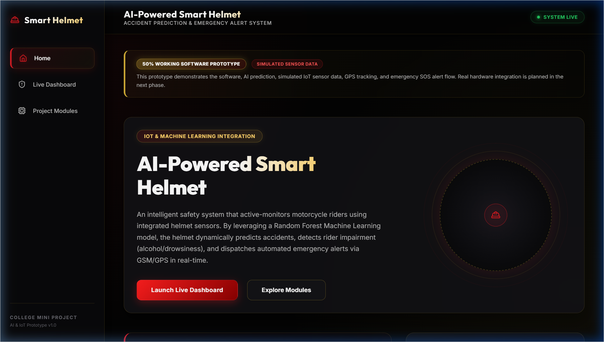

The Home page displays the project title, abstract, navigation buttons, problem definition section, monitoring modules overview, and project statistics. The design uses a professional dark UI design with red-gold accent colors.

**Fig. 8: Project Team Section**

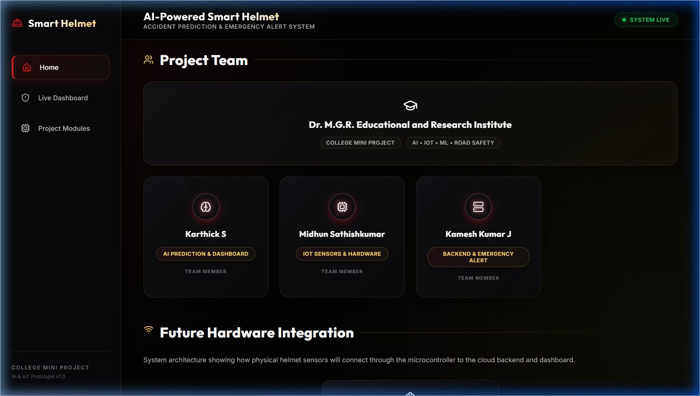

The Project Team section shows team member cards with role-based icons (Brain icon for AI, CPU icon for IoT, Server icon for Backend), member names, and contribution badges. The college name "Dr. M.G.R. Educational and Research Institute" is displayed prominently.

**Fig. 9: Live Dashboard in Safe Mode**

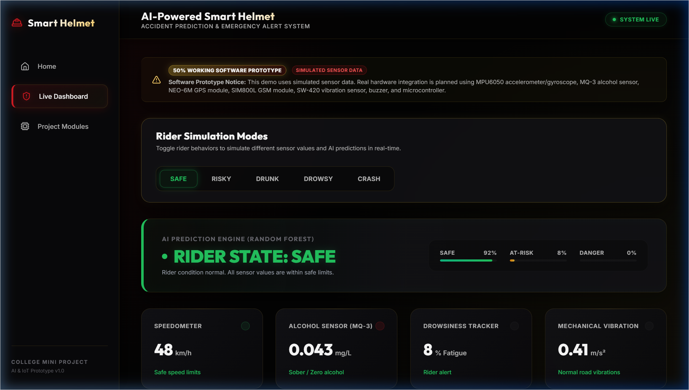

The Live Dashboard in Safe Mode shows all sensor values within normal ranges. The AI prediction panel clearly displays **RIDER STATE: SAFE** with green styling, speed between 30-50 km/h, negligible alcohol level, and drowsiness score below 15%.

**Fig. 10: Risky Mode Showing At-Risk Prediction**

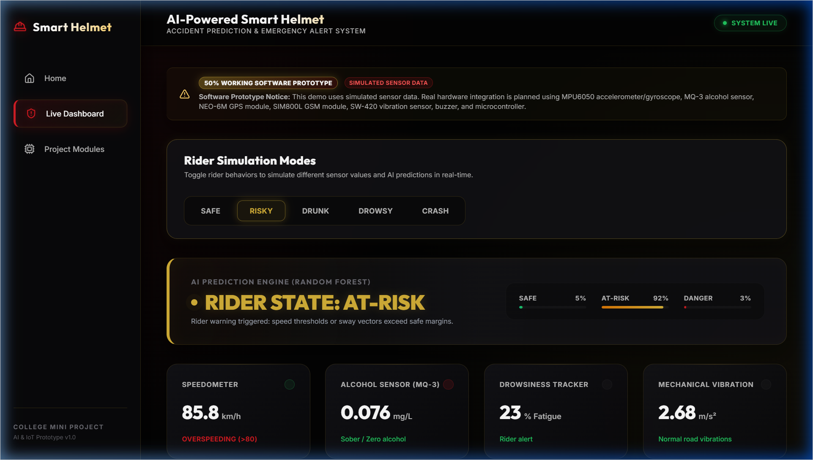

In Risky Mode, the dashboard shows elevated speed (85-95 km/h). The AI prediction panel clearly displays **RIDER STATE: AT-RISK** with amber styling, and the sensor values indicate overspeeding behavior.

**Fig. 11: Drunk Mode Showing Alcohol Detection**

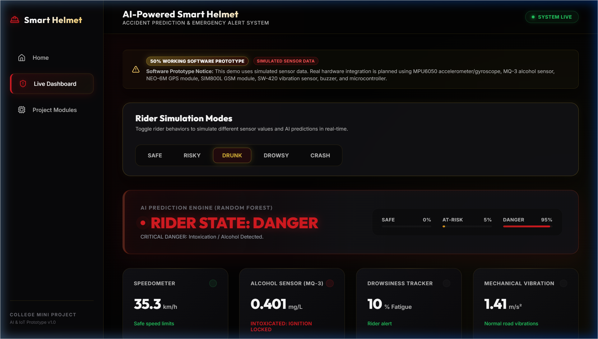

In Drunk Mode, the alcohol sensor card shows elevated readings (0.38-0.45 mg/L). The AI prediction panel clearly displays **RIDER STATE: DANGER** with red styling, and the dashboard shows an alcohol detection warning message.

**Fig. 12: Drowsy Mode Showing Fatigue Warning**

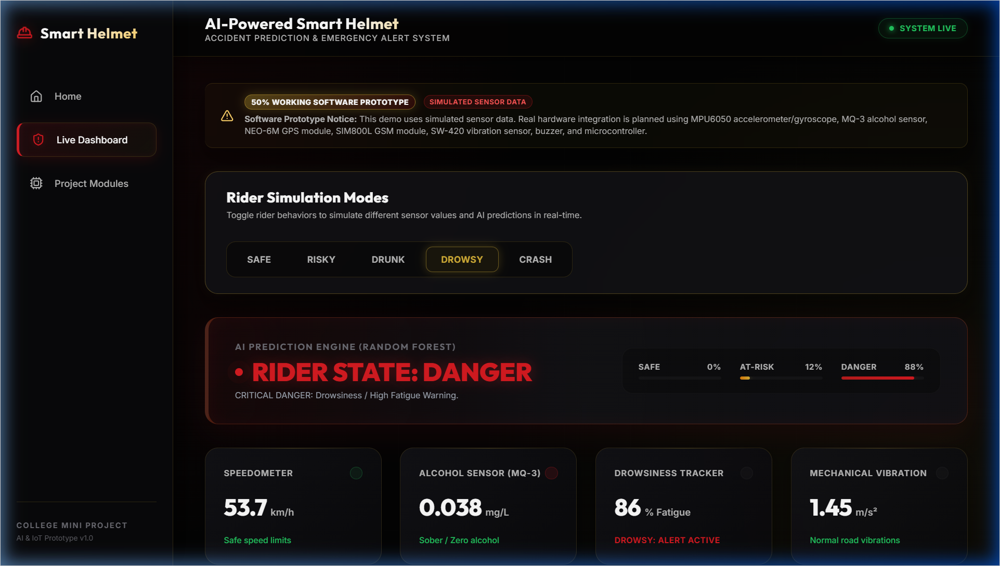

In Drowsy Mode, the drowsiness tracker shows high fatigue scores (82-94%). The AI prediction panel clearly displays **RIDER STATE: DANGER** with red styling, and the dashboard shows a fatigue/drowsiness warning message.

**Fig. 13: Crash Mode Showing Emergency SOS Alert**

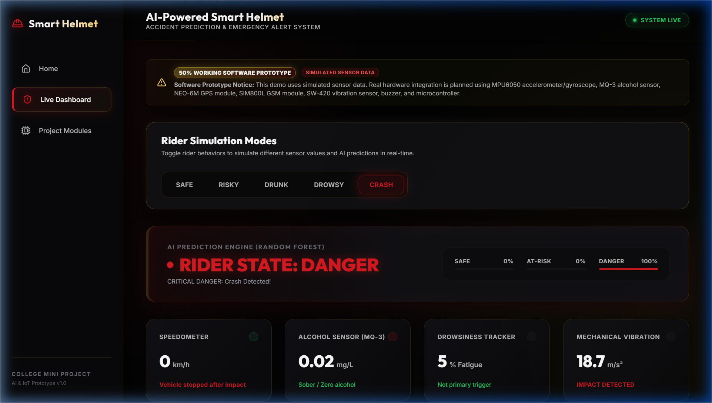

In Crash Mode, the AI prediction panel clearly displays **RIDER STATE: DANGER** with red styling. The Emergency SOS Alert card is displayed prominently, showing crash severity (Critical), impact force (5.2 G / 18.7 m/s²), GPS coordinates, Google Maps link, timestamp, and GSM dispatch status (Sent).

**Fig. 14: GPS Location and Google Maps Link**

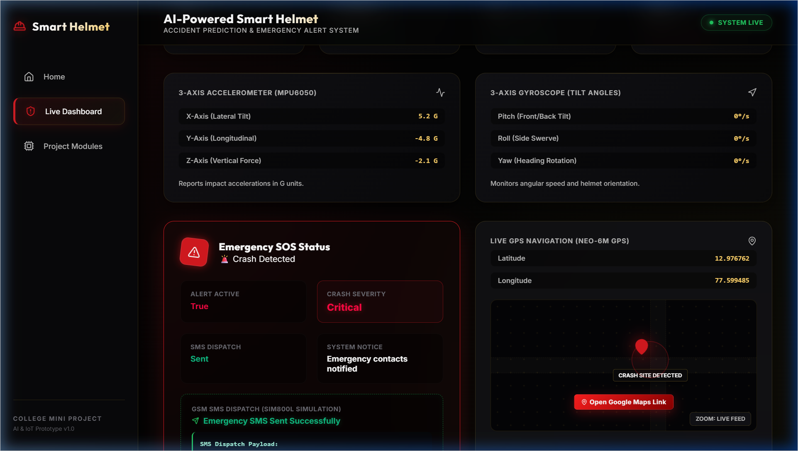

The GPS section shows the rider's current latitude and longitude coordinates with a direct clickable Google Maps link for location visualization.

**Fig. 15: Project Modules Page**

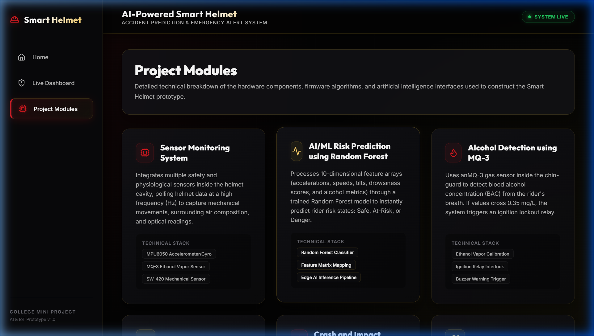

The Modules page displays all eight project modules with icons, descriptions, and technical specifications in a grid layout.

**Fig. 16: Future Hardware Integration Diagram**

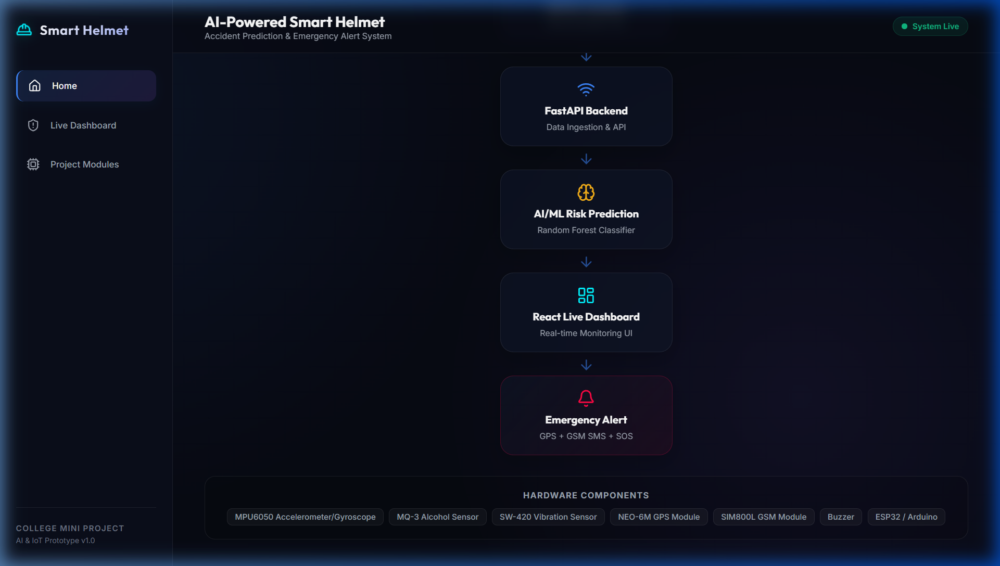

The Future Hardware Integration section on the Home page shows a visual pipeline diagram illustrating the planned sensor-to-cloud architecture with ESP32, Wi-Fi, and cloud components.

**Fig. 17: FastAPI Documentation Page**

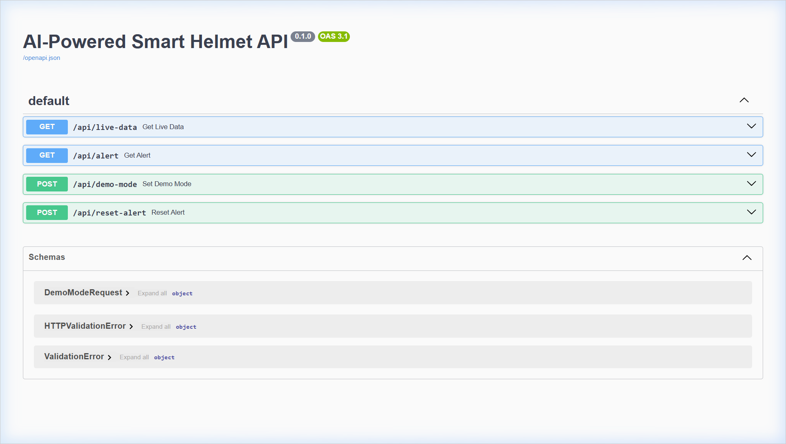

The FastAPI interactive documentation (Swagger UI) displaying the REST API endpoints and data schemas.

---

# CHAPTER 10: TESTING

## 10.1 Testing Overview

The AI-Powered Smart Helmet system was tested comprehensively to ensure correct functionality across all simulation modes, API endpoints, and dashboard components. Testing was performed using manual functional testing, API endpoint verification, and UI behavior validation.

## 10.2 Test Cases and Results

**Table 8: Test Cases and Results**

| Test Case ID | Test Scenario | Input | Expected Output | Actual Output | Status |
|---|---|---|---|---|---|
| TC-01 | Safe mode prediction | Select Safe mode | Rider State: SAFE, Green styling, Speed: 30-50 km/h | Rider State: SAFE, Green styling, Speed: 30-50 km/h | ✅ Pass |
| TC-02 | Risky mode prediction | Select Risky mode | Rider State: AT-RISK, Amber styling, Speed: 85-95 km/h | Rider State: AT-RISK, Amber styling, Speed: 85-95 km/h | ✅ Pass |
| TC-03 | Drunk mode prediction | Select Drunk mode | Rider State: DANGER, Red styling, Alcohol: 0.38-0.45 mg/L | Rider State: DANGER, Red styling, Alcohol: 0.38-0.45 mg/L | ✅ Pass |
| TC-04 | Drowsy mode prediction | Select Drowsy mode | Rider State: DANGER, Red styling, Drowsiness: 82-94% | Rider State: DANGER, Red styling, Drowsiness: 82-94% | ✅ Pass |
| TC-05 | Crash mode prediction | Select Crash mode | Rider State: DANGER, Emergency SOS activated, Vibration: 18.7 m/s² | Rider State: DANGER, Emergency SOS activated, Vibration: 18.7 m/s² | ✅ Pass |
| TC-06 | Emergency SOS activation | Crash mode after impact ticks | SOS card with GPS, Google Maps link, GSM status: Sent | SOS card with GPS, Google Maps link, GSM status: Sent | ✅ Pass |
| TC-07 | GPS link functionality | Click Google Maps link in SOS card | Opens Google Maps with correct coordinates | Opens Google Maps with correct coordinates | ✅ Pass |
| TC-08 | API live-data response | GET /api/live-data | JSON with sensor_data, prediction, history, demo_mode | JSON with sensor_data, prediction, history, demo_mode | ✅ Pass |
| TC-09 | API alert response | GET /api/alert (crash mode) | JSON with alert details, GPS, severity | JSON with alert details, GPS, severity | ✅ Pass |
| TC-10 | API demo-mode switching | POST demo mode endpoint {mode: "risky"} | 200 OK, mode updated to risky | 200 OK, mode updated to risky | ✅ Pass |
| TC-11 | Dashboard UI rendering | Open dashboard page | All cards, charts, and mode buttons render correctly | All cards, charts, and mode buttons render correctly | ✅ Pass |
| TC-12 | Mode switch without delay | Rapidly switch between modes | Immediate sensor and prediction update, no UI lag | Immediate sensor and prediction update, no UI lag | ✅ Pass |

## 10.3 Testing Summary

All 12 test cases passed successfully. The system demonstrates consistent behavior across all simulation modes, with predictions accurately matching the selected mode. API endpoints respond correctly, and the dashboard renders all components without errors. Emergency SOS functionality works reliably in crash mode with correct GPS coordinate extraction and Google Maps link generation.

---

# CHAPTER 11: ADVANTAGES AND APPLICATIONS

## 11.1 Advantages

The AI-Powered Smart Helmet system offers several significant advantages over traditional motorcycle safety approaches:

1. **Improved Rider Safety**: The system provides continuous, real-time monitoring of multiple rider parameters (speed, alcohol, drowsiness, vibration, acceleration), enabling proactive identification of dangerous conditions before accidents occur.

2. **Reduced Emergency Response Delay**: By automatically detecting crash events and immediately dispatching emergency alerts with precise GPS coordinates, the system eliminates the dependency on bystander reporting and significantly reduces the critical "Golden Hour" delay.

3. **Alcohol and Drowsiness Detection**: The integration of alcohol detection (MQ-3 sensor) and drowsiness monitoring (IR sensor) addresses two of the most common causes of motorcycle accidents, providing warnings and, in future hardware implementation, preventing vehicle operation when impairment is detected.

4. **AI-Based Risk Prediction**: Unlike simple threshold-based systems, the Random Forest ML model analyzes complex multi-dimensional sensor patterns to provide more accurate and nuanced risk assessments, classifying conditions as Safe, At-Risk, or Danger with confidence probabilities.

5. **GPS-Based Emergency Location**: Automatic extraction and transmission of GPS coordinates with direct Google Maps links ensures that emergency responders can navigate to the exact accident location without relying on verbal descriptions or landmarks.

6. **Real-Time Dashboard Monitoring**: The web-based dashboard provides real-time visibility into rider safety status, enabling remote monitoring and fleet safety management applications.

7. **Scalable Architecture**: The modular software architecture supports future expansion with additional sensors, communication protocols, and analysis algorithms without requiring complete system redesign.

## 11.2 Applications

The system has diverse practical applications across multiple domains:

1. **Motorcycle Rider Safety**: Primary application for individual motorcycle riders, providing personal safety monitoring and emergency protection during daily commutes and long-distance travel.

2. **Delivery Rider Safety**: Food delivery and courier companies can deploy smart helmets for their rider fleets, enabling centralized safety monitoring and rapid emergency response for delivery personnel.

3. **Industrial Helmet Safety**: The sensor-based monitoring concept can be adapted for industrial helmets used in construction, mining, and manufacturing environments, monitoring worker safety conditions.

4. **Fleet Monitoring and Management**: Transportation companies can use the system for fleet-wide rider safety monitoring, identifying at-risk riding patterns, and ensuring regulatory compliance.

5. **Road Safety Research**: The data logging and analysis capabilities provide valuable data for road safety research, enabling researchers to study riding patterns, accident causes, and the effectiveness of safety interventions.

6. **College IoT/AI Project Demonstration**: The project serves as an educational demonstration of IoT, AI, and web technology integration for academic purposes, showcasing practical applications of these technologies.

---

# CHAPTER 12: LIMITATIONS

The current implementation of the AI-Powered Smart Helmet system has the following limitations:

1. **Simulated Sensor Data**: The current version uses software-simulated sensor data rather than real hardware sensors. The simulated values, while realistic in range, do not capture the full complexity and noise characteristics of real sensor measurements.

2. **No Physical Hardware Integration**: Real sensors (MPU6050, MQ-3, SW-420, NEO-6M) are not yet connected. The system demonstrates the concept through software simulation, with hardware integration planned as future scope.

3. **Simulated SMS Alert**: The emergency SMS dispatch is simulated in the current prototype. The system displays the GSM dispatch status as "Sent" but does not actually transmit SMS messages through a cellular network.

4. **Synthetic Training Data**: The ML model is trained on synthetically generated data rather than real-world accident data. The model's accuracy in real-world conditions may differ from the demonstrated performance.

5. **Accuracy Dependency on Sensor Quality**: In future hardware implementation, the accuracy of predictions will depend significantly on the quality, calibration, and reliability of the physical sensors used.

6. **Hardware Calibration Required**: Physical sensors require careful calibration for each specific helmet and riding environment. Factors such as sensor placement, ambient temperature, and humidity can affect sensor readings.

7. **Internet/Network Dependency**: The current architecture requires network connectivity between the sensor module (or ESP32) and the backend server for ML processing and dashboard display. Loss of connectivity would disrupt real-time monitoring.

8. **Single User Monitoring**: The current system monitors a single rider at a time. Multi-rider fleet monitoring would require architectural modifications for concurrent data processing.

9. **No Mobile Application**: The monitoring dashboard is currently web-based and requires a desktop/laptop browser. A dedicated mobile application would provide more convenient access for riders and family members.

10. **Power Consumption**: In future hardware implementation, the multiple sensors, microcontroller, GPS, and GSM modules will require careful power management to achieve acceptable battery life within the helmet form factor.

---

# CHAPTER 13: FUTURE SCOPE

The AI-Powered Smart Helmet project has significant potential for expansion and improvement in the following areas:

1. **Real Helmet Hardware Integration**: Embed actual sensors (MPU6050, MQ-3, SW-420, IR sensor) within a physical helmet cavity and connect them to an ESP32 microcontroller for real-time data acquisition.

2. **ESP32/Arduino Integration**: Develop firmware for the ESP32 microcontroller that handles sensor data collection, preprocessing, Wi-Fi communication with the backend server, and local alert mechanisms.

3. **Real-Time GPS Tracking**: Integrate the NEO-6M GPS module for actual satellite-based coordinate tracking, enabling accurate real-time location monitoring and emergency location pinpointing.

4. **Actual GSM SMS Alert**: Connect the SIM800L GSM module to enable real cellular SMS dispatch of emergency alerts containing GPS coordinates and crash details to predefined emergency contacts.

5. **Cloud Database Integration**: Migrate from in-memory data storage to a cloud-based database (Firebase, AWS DynamoDB, or Google Cloud Firestore) for persistent data logging, historical analysis, and multi-device access.

6. **Mobile Application Development**: Build dedicated iOS and Android mobile applications for riders and emergency contacts, providing push notifications, real-time monitoring, and emergency response capabilities.

7. **Real Accident Dataset Training**: Train the ML model on real-world accident data obtained from traffic safety databases, hospital records, or controlled testing, improving prediction accuracy for actual riding conditions.

8. **Hospital and Emergency Service Integration**: Establish direct communication channels with nearby hospitals and ambulance services for automated emergency dispatch, potentially integrating with national emergency response systems (112 in India).

9. **Ignition Lock Using Relay Module**: Implement a physical relay module connected to the motorcycle's ignition circuit that prevents engine starting when unsafe alcohol levels are detected.

10. **Voice Alert and Buzzer System**: Add an active buzzer and speaker inside the helmet for audible voice alerts and warning sounds, providing immediate feedback to the rider without requiring visual attention.

11. **Helmet Wearing Detection**: Incorporate a pressure sensor or proximity sensor to detect whether the rider has properly worn the helmet before allowing the motorcycle to start.

12. **Battery-Powered Compact Circuit**: Design a compact, battery-powered PCB (Printed Circuit Board) that integrates all components within the helmet without adding significant weight or compromising rider comfort.

---

# CHAPTER 14: CONCLUSION

The **AI-Powered Smart Helmet with Accident Prediction and Emergency Alert System** successfully demonstrates the integration of Artificial Intelligence, Internet of Things, and modern web technologies to address the critical problem of motorcycle rider safety.

Through this mini project, we have developed a **50% working software prototype** that showcases the complete data pipeline - from sensor data acquisition (simulated) to AI-based risk prediction using a Random Forest Classifier, and finally to emergency alert dispatch simulation with GPS coordinates.

The key achievements of this project include:

1. **Machine Learning Integration**: A Random Forest Classifier trained on a 10-dimensional sensor feature space, capable of classifying rider conditions into three risk levels (Safe, At-Risk, Danger) with high confidence.

2. **Full-Stack Web Application**: A professional-grade web application comprising a FastAPI backend (Python) and a React.js frontend (Vite), providing a real-time monitoring dashboard with live telemetry, AI predictions, historical charts, and emergency alerts.

3. **Comprehensive Simulation System**: Five distinct simulation modes (Safe, Risky, Drunk, Drowsy, Crash) that demonstrate the system's response to different rider conditions with realistic sensor value patterns.

4. **Emergency Alert Mechanism**: An automated crash detection and emergency response system that extracts GPS coordinates, generates Google Maps links, and simulates GSM SMS dispatch to emergency contacts.

5. **Modular Architecture**: A software architecture designed for seamless transition to physical hardware, with clear interfaces between sensor data acquisition, ML prediction, and dashboard presentation layers.

The project validates the concept that an intelligent helmet system can significantly improve motorcycle rider safety by providing continuous monitoring, proactive risk prediction, and automated emergency response. The software prototype serves as a solid foundation for future hardware development using ESP32 microcontrollers and the planned sensor suite.

This project has provided valuable hands-on experience in full-stack web development, Machine Learning model training and deployment, REST API design, real-time telemetry visualization, and system architecture design - skills that are directly applicable to professional software engineering and IoT development careers.

---

# CHAPTER 15: REFERENCES / BIBLIOGRAPHY

1. FastAPI - Modern, Fast (high-performance) Web Framework for Building APIs with Python 3.7+. Official Documentation. Available at: https://fastapi.tiangolo.com/

2. React - A JavaScript Library for Building User Interfaces. Official Documentation. Available at: https://react.dev/

3. Vite - Next Generation Frontend Tooling. Official Documentation. Available at: https://vitejs.dev/

4. Scikit-learn - Machine Learning in Python. Official Documentation. Available at: https://scikit-learn.org/

5. NumPy - The Fundamental Package for Scientific Computing with Python. Official Documentation. Available at: https://numpy.org/

6. Pandas - Python Data Analysis Library. Official Documentation. Available at: https://pandas.pydata.org/

7. Recharts - A Composable Charting Library Built on React Components. Official Documentation. Available at: https://recharts.org/

8. World Health Organization (WHO), "Global Status Report on Road Safety," 2023. Available at: https://www.who.int/publications/i/item/9789240086517

9. National Crime Records Bureau (NCRB), Ministry of Home Affairs, Government of India, "Accidental Deaths and Suicides in India," Annual Report.

10. InvenSense Inc., "MPU-6050 Six-Axis (Gyro + Accelerometer) MEMS MotionTracking Device," Product Datasheet.

11. Zhengzhou Winsen Electronics Technology Co., Ltd., "MQ-3 Semiconductor Sensor for Alcohol Detection," Technical Datasheet.

12. U-blox AG, "NEO-6M GPS Module," Product Datasheet and Integration Manual.

13. SIMCom Wireless Solutions Ltd., "SIM800L GSM/GPRS Module," Hardware Design Guide.

14. Espressif Systems, "ESP32 Technical Reference Manual," Available at: https://www.espressif.com/en/products/socs/esp32

15. General references on IoT-based accident detection systems, smart helmet technology, drowsiness detection methods, and alcohol detection in vehicle safety - *[Placeholder: Replace with specific verified research paper citations as needed]*.

---

# APPENDIX A: BACKEND API DETAILS

## A.1 API Endpoints Summary

| Method | Endpoint | Description |
|--------|---------|-------------|
| GET | /api/live-data | Returns current sensor data, prediction, history, and mode |
| GET | /api/alert | Returns current emergency alert status and details |
| POST | /api/demo-mode | Switches simulation mode (body: {"mode": "safe"}) |
| POST | /api/reset-alert | Resets alert state and returns to safe mode |

## A.2 GET /api/live-data Response Format

```json
{
  "demo_mode": "safe",
  "sensor_data": {
    "speed": 42.3,
    "vibration": 0.87,
    "alcohol_level": 0.023,
    "drowsy_score": 0.082,
    "accel_x": 0.05,
    "accel_y": -0.03,
    "accel_z": 1.02,
    "gyro_x": 1.4,
    "gyro_y": -0.8,
    "gyro_z": 2.1,
    "latitude": 12.9716,
    "longitude": 77.5946
  },
  "prediction": {
    "status": "Safe",
    "class_probabilities": {
      "Safe": 0.92,
      "At-Risk": 0.08,
      "Danger": 0.0
    }
  },
  "history": [...],
  "alert_active": false
}
```

## A.3 GET /api/alert Response Format (Crash Active)

```json
{
  "is_active": true,
  "severity": "Critical",
  "impact_force": "5.2 G (Horizontal) / 18.7 Vibration",
  "timestamp": "2025-01-15 14:32:18",
  "latitude": 12.9716,
  "longitude": 77.5946,
  "gsm_status": "Sent"
}
```

## A.4 POST demo mode endpoint Request Format

```json
{
  "mode": "crash"
}
```

Valid modes: `safe`, `risky`, `drunk`, `drowsy`, `crash`

---

# APPENDIX B: IMPORTANT CODE SNIPPETS

## B.1 Random Forest Model Training (model.py)

```python
def train_model():
    """Trains and saves the Random Forest classifier model."""
    df = generate_synthetic_data(1500)
    X = df.drop(columns=["label"])
    y = df["label"]
    X_train, X_test, y_train, y_test = train_test_split(
        X, y, test_size=0.2, random_state=42
    )
    model = RandomForestClassifier(
        n_estimators=80, max_depth=8, random_state=42
    )
    model.fit(X_train, y_train)
    joblib.dump(model, MODEL_PATH)
    return model
```

## B.2 Prediction Function (model.py)

```python
def predict_status(sensor_data: dict) -> dict:
    feature_names = [
        "speed", "vibration", "alcohol_level", "drowsy_score",
        "accel_x", "accel_y", "accel_z",
        "gyro_x", "gyro_y", "gyro_z"
    ]
    features = [float(sensor_data.get(name, 0.0))
                for name in feature_names]
    features_arr = np.array([features])
    prediction = model.predict(features_arr)[0]
    probabilities = model.predict_proba(features_arr)[0]
    status_map = {0: "Safe", 1: "At-Risk", 2: "Danger"}
    return {
        "status": status_map[prediction],
        "class_probabilities": {
            "Safe": float(probabilities[0]),
            "At-Risk": float(probabilities[1]),
            "Danger": float(probabilities[2])
        }
    }
```

## B.3 FastAPI Live Data Endpoint (main.py)

```python
@app.get("/api/live-data")
def get_live_data():
    with state.lock:
        return {
            "demo_mode": state.demo_mode,
            "sensor_data": state.sensor_data,
            "prediction": state.prediction,
            "history": state.history,
            "alert_active": state.alert_active
        }
```

## B.4 Frontend API Layer (api.js)

```javascript
const BASE_URL = 'http://127.0.0.1:8080';

export async function fetchLiveData() {
    const res = await fetch(`${BASE_URL}/api/live-data`);
    return res.json();
}

export async function fetchAlert() {
    const res = await fetch(`${BASE_URL}/api/alert`);
    return res.json();
}

export async function setDemoMode(mode) {
    const res = await fetch(`${BASE_URL}/api/demo-mode`, {
        method: 'POST',
        headers: { 'Content-Type': 'application/json' },
        body: JSON.stringify({ mode })
    });
    return res.json();
}
```

---

# APPENDIX C: RUN COMMANDS

## C.1 Backend Setup and Run

```bash
# Navigate to backend directory
cd backend

# Create virtual environment
python -m venv .venv

# Activate virtual environment (Windows)
.venv\Scripts\activate

# Install dependencies
pip install -r requirements.txt

# Start backend server
uvicorn main:app --reload --port 8080
```

The backend API documentation (Swagger UI) is available at: `http://127.0.0.1:8080/docs`

## C.2 Frontend Setup and Run

```bash
# Navigate to frontend directory
cd frontend

# Install dependencies
npm install

# Start development server
npm run dev
```

The frontend application is available at: `http://localhost:5174/`

---

# APPENDIX D: DEMO FLOW

Follow this sequence during the live project presentation:

1. **Open Home Page** -> Explain the project title, abstract, and problem definition.
2. **Scroll to Project Team** -> Show the team members, contribution badges, and college affiliation.
3. **Scroll to Hardware Integration** -> Walk through the planned sensor-to-cloud architecture diagram.
4. **Navigate to Live Dashboard** -> Point out the prototype badge and simulation disclaimer.
5. **Start in Safe Mode** -> Show the green "SAFE" prediction with stable sensor values.
6. **Switch to Risky Mode** -> Highlight the amber "AT-RISK" state with elevated speed.
7. **Switch to Drunk Mode** -> Show "DANGER" state with alcohol detection warning.
8. **Switch to Drowsy Mode** -> Demonstrate fatigue warning and drowsiness alerts.
9. **Switch to Crash Mode** -> Showcase the emergency SOS card, GPS coordinates, Google Maps link, and GSM dispatch log.
10. **Reset to Safe Mode** -> Confirm real-time mode switching capability.
11. **Navigate to Modules Page** -> Walk through all 8 project modules with descriptions.
12. **Open Swagger Docs** (`http://127.0.0.1:8080/docs`) -> Briefly demonstrate the live API endpoints.

---

# APPENDIX E: HARDWARE COMPONENTS LIST

| S.No. | Component | Specification | Quantity | Purpose |
|-------|-----------|--------------|----------|---------|
| 1 | ESP32 DevKit V1 | Dual-core 240MHz, Wi-Fi + BLE | 1 | Central microcontroller |
| 2 | MPU6050 Module | 6-axis MEMS (3-axis accel + 3-axis gyro) | 1 | Impact and orientation detection |
| 3 | MQ-3 Sensor | Semiconductor alcohol gas sensor | 1 | Breath alcohol detection |
| 4 | SW-420 Sensor | Normally closed vibration sensor | 1 | Mechanical vibration/impact |
| 5 | NEO-6M GPS | 50-channel GPS receiver, UART | 1 | Real-time location tracking |
| 6 | SIM800L Module | Quad-band GSM/GPRS, UART | 1 | SMS emergency alert dispatch |
| 7 | Active Buzzer | 5V piezoelectric buzzer | 1 | Audible warning alerts |
| 8 | 5V Relay Module | Single-channel, optocoupler isolated | 1 | Ignition lock control |
| 9 | IR Sensor | Infrared proximity/reflective | 1 | Eye blink/drowsiness detection |
| 10 | Li-Po Battery | 3.7V, 2000mAh | 1 | Power supply |
| 11 | Voltage Regulator | AMS1117 3.3V | 1 | Power regulation for ESP32 |
| 12 | Helmet | ISI-certified full-face helmet | 1 | Physical housing |
| 13 | Jumper Wires | Male-Male, Male-Female | Assorted | Sensor connections |
| 14 | Breadboard | 830-point | 1 | Prototyping connections |
| 15 | USB Cable | Micro-USB (for ESP32 programming) | 1 | Programming and power |

*Note: These components are listed for future hardware implementation. The current software prototype uses simulated sensor data.*

---

**END OF REPORT**
